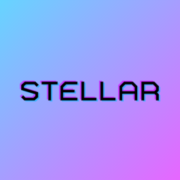

# Project Stellar

 
 
 
 

> stellar (adj) - exceptionally good; outstanding.

The world's most powerful add-on for the Original Xbox. StellarOS is the first completely legal re-implementation of the retail Xbox BIOS.

## About

Project Stellar
Development of Project Stellar started in 2020, shortly after the release of the XboxHDMI, with the goal of creating the best possible add-on board for the Original Xbox. Using modern software and hardware, we wanted to create something unique that would push the limits what's possible... we wanted to create something stellar.

With Project Stellar we set out to build the best possible platform. The hardware was carefully chosen to be as flexible and future-proof. This allowed us to continue on our mission of not only fixing all the problems and issues of the original system, but also adding additional features that have been considered impossible in the past.

Traditional mods for the Original Xbox have used the LPC port to force the system to load an alternative BIOS, operating system, on boot and nothing more. What's seemed to be lost for the last two decades is the fact that this interface can provide so much more.

Project Stellar takes full advantage of the LPC interface. On board Project Stellar is a modern and top-of-its-class FPGA that fully implements the memory interface used for the BIOS, as well as the complete LPC interface for I/O and DMA transactions.

[Product Press Release](https://makemhz.com/blogs/news/announcing-project-stellar-plus-more)

## Documentation
* [Initial Setup](https://support.makemhz.com/project-stellar/initial-setup)
* [Installation Guide](https://support.makemhz.com/project-stellar/installation-guide)
* [Installation Troubleshooting](https://support.makemhz.com/project-stellar/installation-troubleshooting)
* [Firmware Recovery](https://support.makemhz.com/project-stellar/firmware-recovery)
* [Knowledge Base](https://support.makemhz.com/project-stellar/knowledge-base)
* [User Guide](https://support.makemhz.com/project-stellar/user-guide/getting-started)
