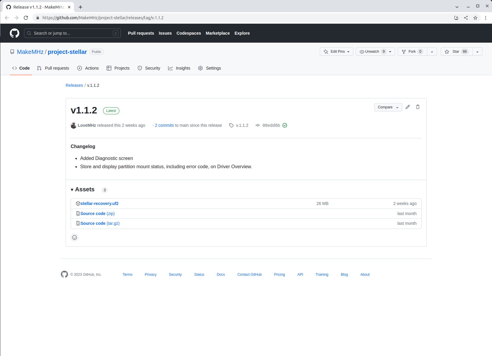
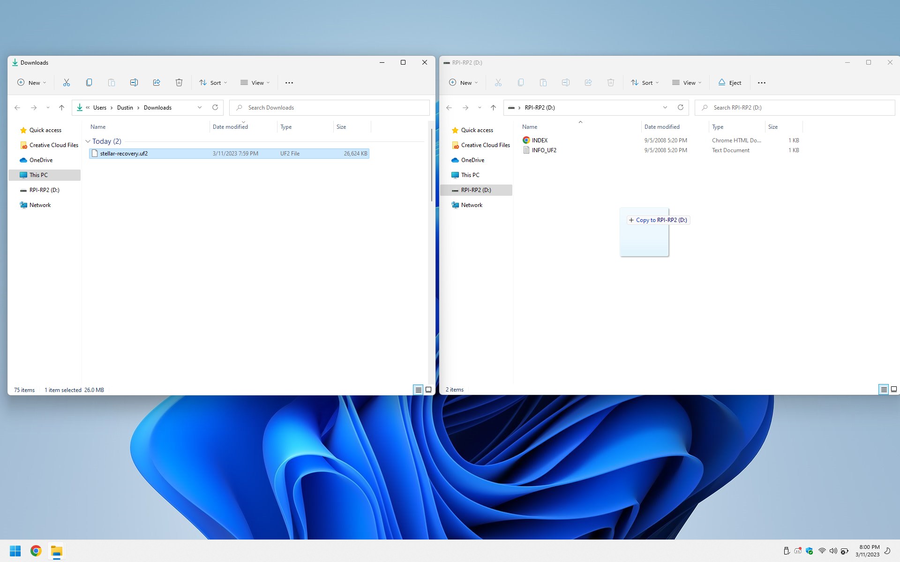
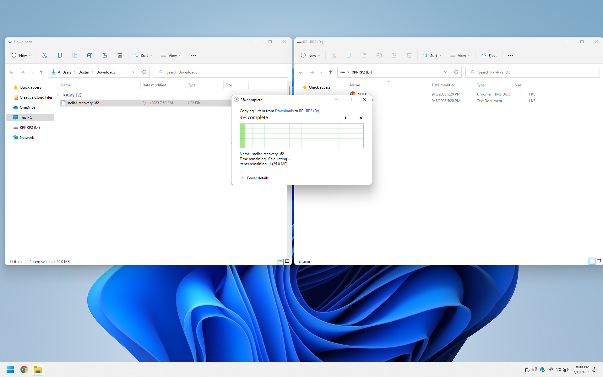

## Overview
- Disconnect power from the Xbox and discharge by pressing the power button.
- Disconnect Project Stellar from the system.
- While holding the button on the side of the Stellar board connect it to a computer via USB. Once connected, release the button.
- A mass storage device will appear "RPI-RP2".
- Drag and drop the 'stellar_recovery.uf2' to the RPI-RP2 drive.
- Wait for file to transfer.
## Download
The latest recovery firmware can be found at [https://github.com/MakeMHz/project-stellar/releases/latest](https://github.com/MakeMHz/project-stellar/releases/latest).

Click and download the ``stellar_recovery.uf2`` file.

## Restore
Drag and drop the 'stellar_recovery.uf2' to the RPI-RP2 drive. Wait for the file transfer to complete. This process can take up to 10 minutes, so be patient.

## Troubleshooting
### Missing RPI-RP2
- Make sure the recovery button is pressed before connecting Project Stellar to your computer and released afterwards.
- Try a different port, cable, or computer.
