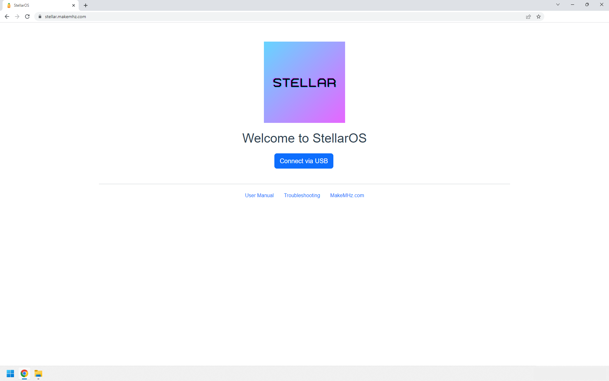
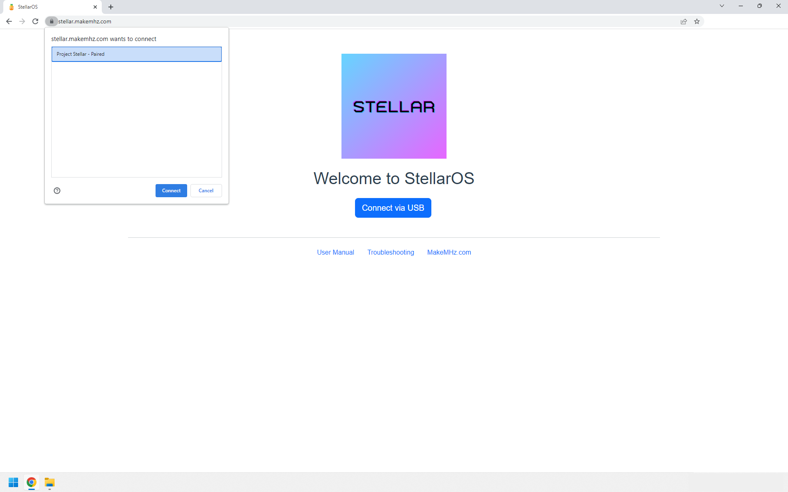
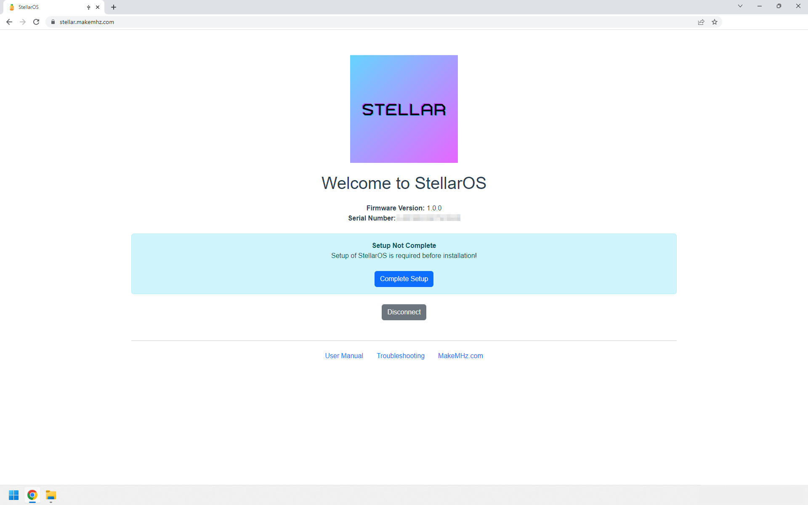
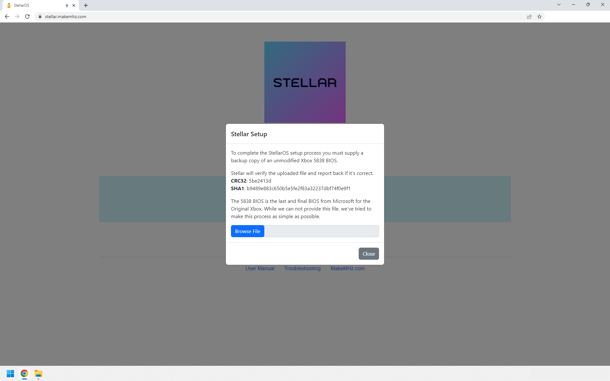
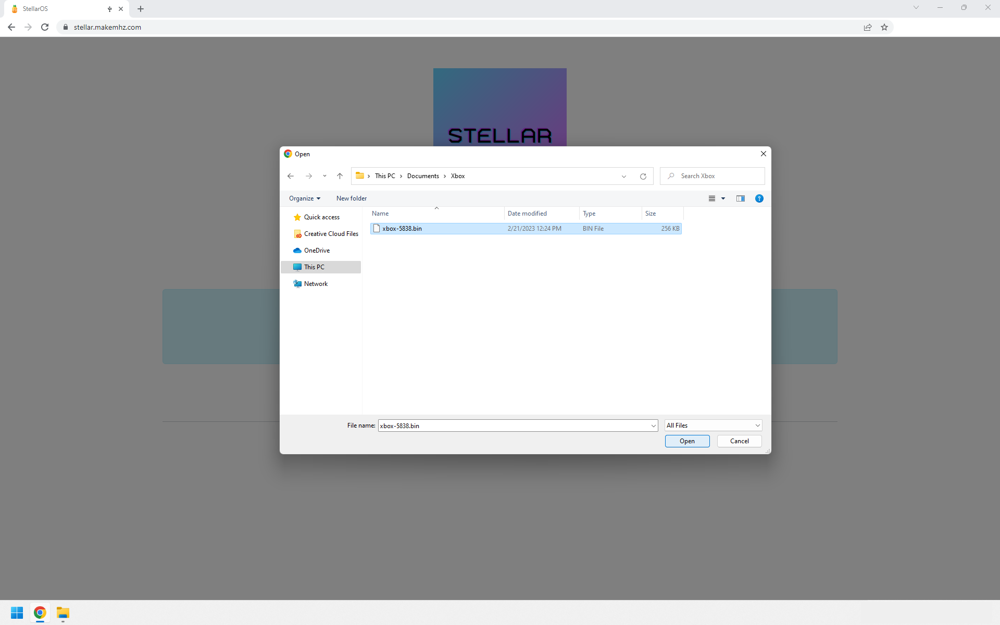
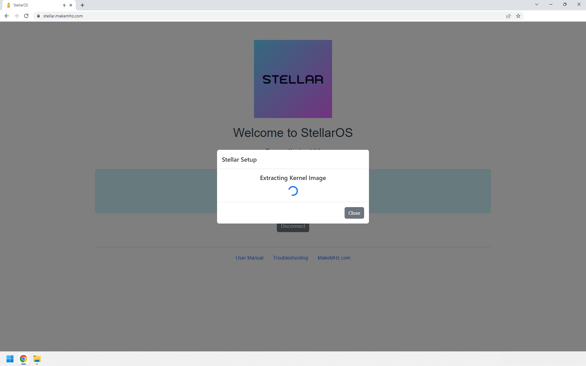
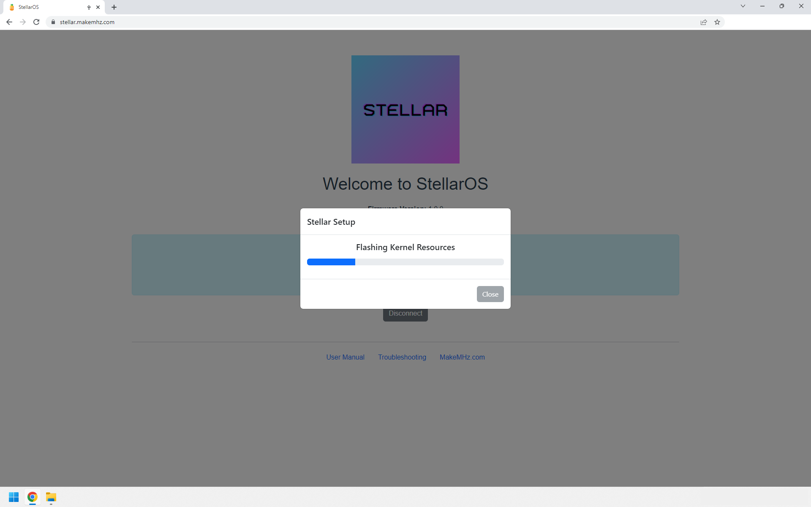
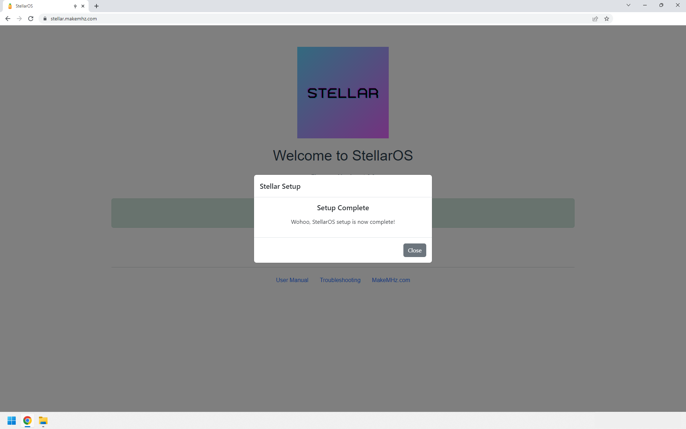
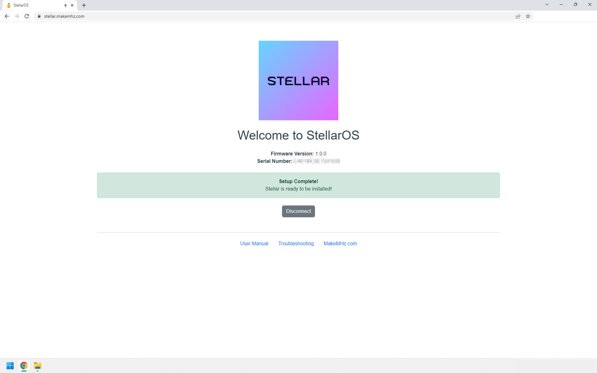

# Project Stellar - Initial Setup
The initial setup for Project Stellar is pretty straightforward; this guide will guide you through each step.

## Requirements
- Chrome or Microsoft Edge web browser

### Linux
- Create udev rule
```echo 'SUBSYSTEMS=="usb", ATTRS{idVendor}=="16d0", ATTRS{idProduct}=="119c", GROUP="users", MODE="666"' | sudo tee /etc/udev/rules.d/99-stellar.rules```
- Reload udev

## Setup
- Connect Project Stellar to your computer via USB

- Navigate to [stellar.makemhz.com](https://stellar.makemhz.com)



- Click "Connect via USB" and choose "Project Stellar" from the popup window



- Click "Complete Setup"



- Select your unmodified Xbox 5838 BIOS image





- Wait for for setup to complete




- All done!



