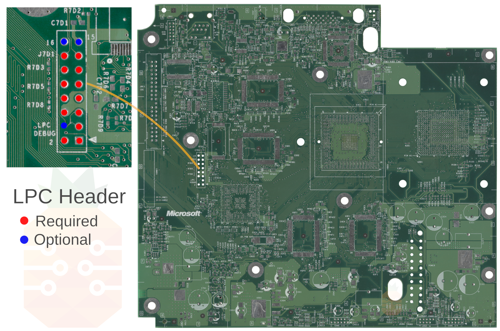
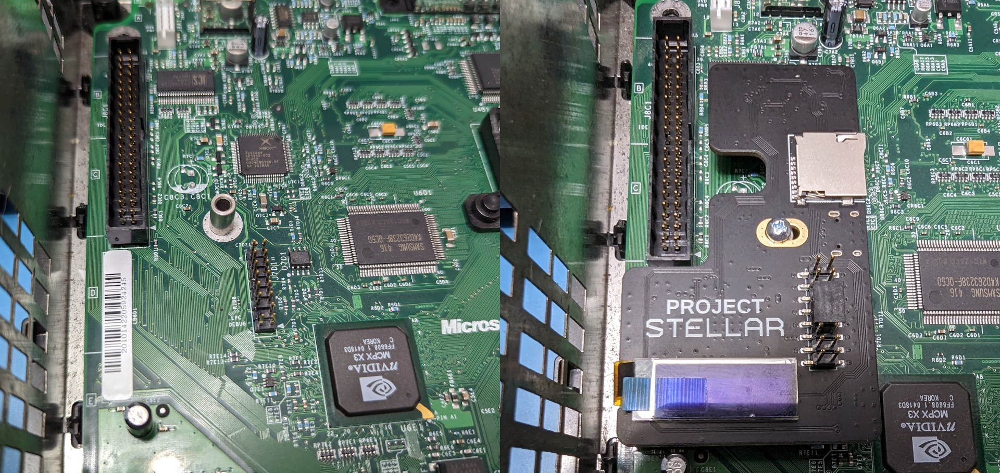

# Project Stellar - Installation Guide

- [Brief Overview](#brief-overview)
- [Preparation](#preparation)
  * [Kit Contents](#kit-contents)
  * [Resources](#resources)
- [Step 1 - Initial Setup](#step-1---qsb-installation)
- [Step 2 - LPC Pin Header](#step-2---lpc-pin-header)
  * [Xbox Revisions 1.0 - 1.5](#xbox-revisions-10---15)
  * [Xbox Revision 1.6](#xbox-revision-16)
- [Step 3 - Easy D0](#step-3---easy-d0)
- [Step 4 - Mounting](#step-4---mounting)

## Brief Overview
*Installation video coming soon.*

## Preparation
**Make sure to carefully read the entire document in full before you start! Familiarize yourself with all the steps and how they are to be carried out. Do not skip any steps, and use the provided pictures to compare your results.**

Before your adventure begins, it's imperative to ensure that you have a fully working and tested Xbox.

### Kit Contents
Check your kit for missing or damaged pieces before moving forwards.

- Project Stellar
- Easy D0
- Xbox 1.6 LPC Rebuild QSB
- Metal Stand-off with Screw
- 2x8 Gold Plated Pinheader

### Resources
[Identifying Xbox Revision](https://github.com/MakeMHz/xbox-hd-plus/blob/master/manual/Identifying%20Xbox%20Revision.md)

[Initial Setup](Initial%20Setup.md)

## Step 1 - Initial Setup
The initial setup process must be completed first and is provided as a seperate guide.
[Initial Setup](Initial%20Setup.md)

## Step 2 - LPC Pin Header
Project Stellar currently requires that at minimum a 2x7 pin header be installed on the LPC of the Xbox. It's recommended to install the included high-quality gold-plated 2x8 pin header if possible as future features may require the additional pins.

### Xbox Revisions 1.0 - 1.5
- Locate the LPC header on the motherboard.
- Remove factory solder from the through holes.
- Solder in the supplied pin header.

### Xbox Revision 1.6
Installation of the pin header on a 1.6 revision motherboard requires that we solder in the LPC rebuild QSB while holding the pin header in place. For this, we recommend using hot glue, Blu-Tack, or some other temporary adhesive.

- Locate the LPC header on the motherboard.
- Remove factory solder from the through holes.
- Solder in the supplied LPC rebuild QSB while holding in place the pin header. Make sure to solder all of the points on the QSB to the motherboard.

## Step 3 - Easy D0
For Xbox revisions 1.0 - 1.5 we must connect D0 to ground to force the system to always boot from the LPC port. On the 1.6 motherboard, this is handled automatically by Project Stellar.

- Align the Easy D0 QSB and tape down according to the reference images provided below.
- Solder the QSB into place.

## Step 4 - Mounting

- Place the provided metal spacer over the PCB hole as shown.
- Use the provided Phillips screw to mount Project Stellar. Do not over-tighten, the screw only needs to be lightly tightened.

## Done
All done! 

If you have an HDMI kit, then you can use the links below to install those.

[Stellar XboxHD+ Installation Guide 1.0 - 1.5](https://github.com/MakeMHz/xbox-hd-plus/blob/master/manual/Installation%20Manual%20(Stellar%20XboxHD%2B%20v2%201.0%20-%201.5).md)

[Stellar XboxHD+ Installation Guide 1.6](https://github.com/MakeMHz/xbox-hd-plus/blob/master/manual/Installation%20Manual%20(Stellar%20XboxHD%2B%20v2%201.6).md)
