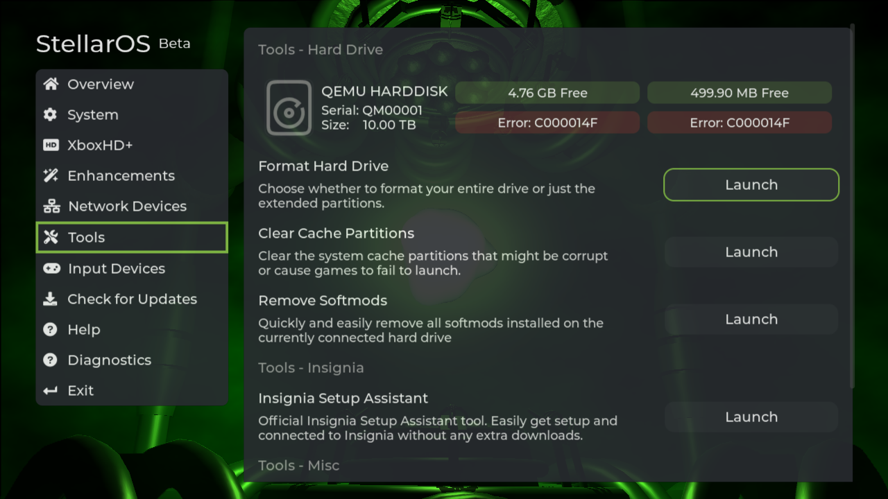

# Knowledge Base
The knowledge base is a collection of information that hasn't quite found a place in another guide/manual for Project Stellar.

## General
#### In-Game Reset Button Combo
``Left Stick Button + Right Stick Button + Full Left Trigger + Full Right Trigger``

#### Custom Dashboard Path
``E:\dashboard\default.xbe``

## Hard Drive and Partitioning
A small write up on drive paritioning can be found here from our [Project Stellar - Firmware Update 1.1.2](https://makemhz.com/blogs/news/project-stellar-firmware-update-1-1-2) update post.

### Common Issues
- Missing extended paritions.
- Missing files.
- Game loading issues.

### Cause
- Corrupt/missing partition table.
- Corrupt filesystem.
- Unsupported partition cluster sizing.

### Error Codes

#### 0xC000014F - CLUSTER_SIZE
Stellar requires that partitions are limited to 2^24 clusters due to how the kernel caches file information in-memory.

### Solutions
- If the system partitions are mounting correctly, then the Format Hard Drive" -> "Format Extended Partitions" tool can be used, inside of StellarOS, to format the extended paritions and to create a new valid partition table.
- If none of the partitions are mounting correctly then a full drive reformat will be required. StellarOS provides this tool under "Format Hard Drive" -> "Wipe Entire Drive".

## Custom Dashboard
Be sure to check the diagnostic screen. A warning will be displayed if the custom dashboard path is missing.

### Common Issues
- Custom dashboard not loading (stock retail dashboard loading instead).

### Cause
- Missing ``E:\dashboard\default.xbe``
- Corrupt ``E:\dashboard\default.xbe`` or missing assets
- Corrupt, or missing, E partition.

### Solution
- Move(rename) your desired dash board to ``E:\dashboard\default.xbe``

## Known Issues

### Video signal lost at the end of Stellar updates on HDMI systems
Currently the Stellar board resets at the end of a firmware update causing HDMI video to drop.

**Workaround:** Power-off the system at the end of the update process. It's safe to turn the system off when the output says so, or when the signal is lost.

### Check for Update Freezing
This is being investigated. Improved in firmware version 1.0.2

**Workaround:** Reboot and try again

### Savings settings freezes system
~~Fixed in firmware version 1.0.2.~~

### FlashFXP
~~Connects but does not display any files.~~

~~**Workaround:** Use an alternative FTP client such as FileZilla.~~

Fixed in firmware version 1.0.3

## FAQ

#### What about INSERT feature?
The goal right now is making sure all orders ship out and everything is 100% stable before enabling or adding additional features.

#### Can the C:\xboxhd folder be removed?
Yes, the XboxHD+ app and patches are no longer needed. It's probably best to delete as not to confuse someone else later on.
